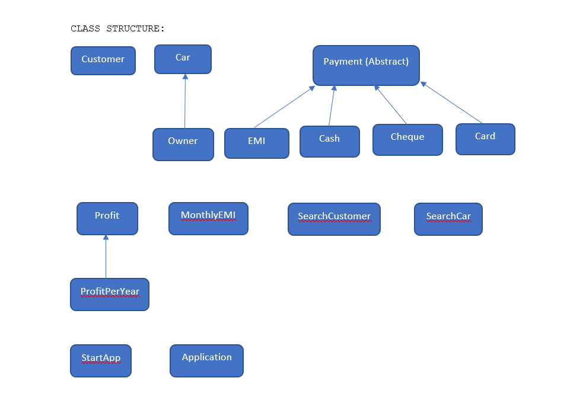

# Second-Hand-Car-Selling-System
This repo contains project I developed using Core Java concepts for Second Hand Car Selling System (SHCSS). SHCSS applies Core Java Concepts like Inheritance, Abstraction, Interfaces and many more.
My SHCSS is helpful for vendors/agents to handle customer details, car details, car owner details,
Payment data including types of payment like EMI, Cash, Cheque, Card and profit obtained from a car year-wise.

CLASS DESCRIPTION:

CUSTOMER: To handle customer operations

CAR: To handle car operations

OWNER: Inner class of CAR to handle car-owner details

PAYMENT: Abstract class to handle payment operations

EMI: Inner class of PAYMENT to handle payments through EMI

CASH: Inner class of PAYMENT to handle payments through CASH

CHEQUE: Inner class of PAYMENT to handle payments through CHEQUE

CARD: Inner class of PAYMENT to handle payments through CARD

PROFIT: To handle profits obtained from a car

ProfitPerYear: To handle profits obtained from a car within a year

MonthlyEMI: To support class EMI by handling monthly EMI of a car

SearchCustomer: To search customer on various attributes

SearchCar: To search car on various attributes

StartApp: To handle back-end operations of SHCSS

Application: Main class to start SHCSS

Basic Operations can be performed:

Customer Operations:
1. Add Customer
2. Update Customer Details
3. Display Customer Details
4. Set Car Purchased Status
5. Display Car Purchased Status
6. Book a Car
7. Display Car(s) booked/purchased
8. Set Mode of Payment for a Car
9. Display Mode of Payment of a Car
10. Remove Customer
11. Search Customer
12. Display All Customers

Car Operations:
1.	Add Car
2. Update Car Details
3. Display Car Details
4. Set Car Purchased Status
5. Display Car Purchased Status
6. Add Car Owner Details
7. Display Car Owner Details
8. Get EMI Value of Car
9. Set EMI Value of Car
10. Remove Car
11. Search Car
12. Display All Cars

Payment Operations:
1.	Display EMI List for All Customers
2.	Display EMI List of Customer
3. Add EMI to Customer
4. Set EMI Paid Status
5. Display Cash List
6. Add Cash Data of Customer
7. Delete Cash Data of Customer
8. Display Cash Pending Payment Status
9. Update Cash Pending Payment Status
10. Display Cheque List
11. Add Cheque Data of Customer
12. Delete Cheque Data of Customer
13. Display Cheque Pending Payment Status
14. Update Cheque Payment Status
15. Display Card List
16. Add Card Data of Customer
17. Delete Card Data of Customer
18. Display Card Payment Status
19. Update Card Payment Status

Profit Operations:
1. Display Profit List
2. Add Profit
3. Update Profit a Car
4. Delete Profit of a Car

NOTE: There are many more functions that are defined in SCHSS but not used that can be used as per user’s need.

Future Scope:
Second Hand Car Selling System (SCHSS) have large scope like we can use DBMS like MySQL to store and handle data, and many more.

Suggestions and improvements are always welcome.

